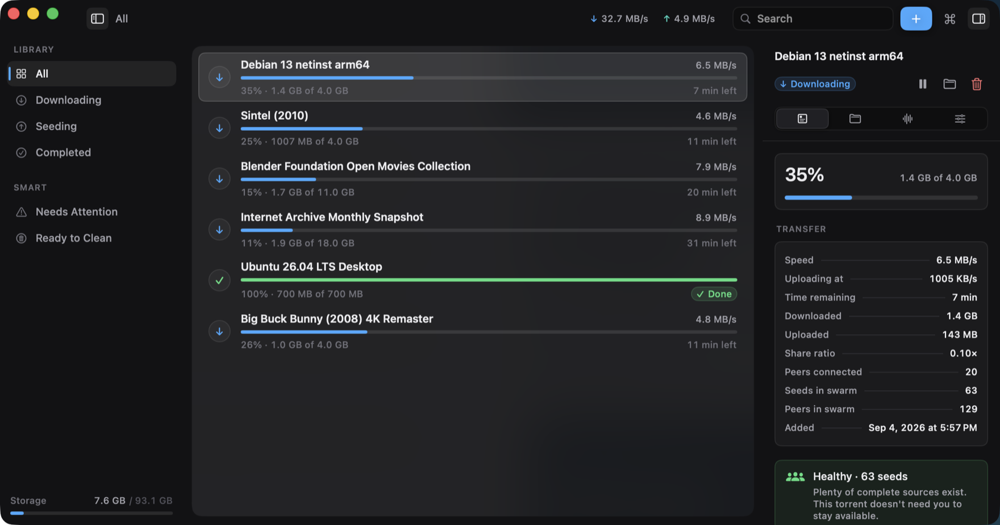
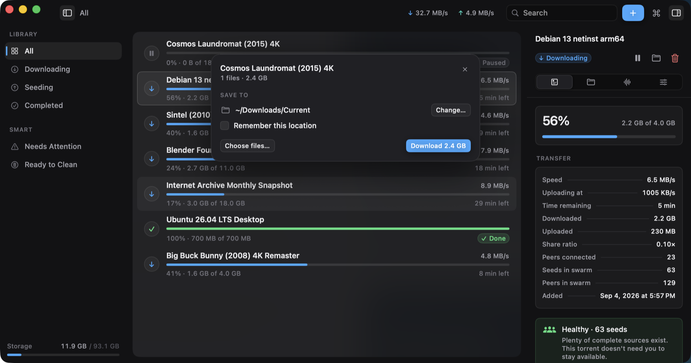
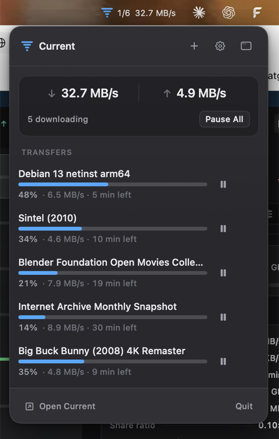

<div align="center">

# Current

**A torrent client that behaves.**

Native macOS · Swift 6 · SwiftUI · libtorrent 2.x · Apple Silicon · macOS 26+

### [Download for Mac →](https://current.alantom.dev)

10.4 MB download, 30 MB installed · signed and notarised by Apple · free and MIT-licensed



</div>

---

Current is a native macOS BitTorrent client built around one insight:
**torrenting is mostly a background activity.** The most useful interface is
not a permanently-open dashboard — it's excellent background automation,
glanceable activity, and fast intervention when something needs you.

So Current is quiet when nothing is happening, informative when something is
happening, and delightful when you interact with it.

It draws its own window chrome and every one of its own controls. There is no
`NavigationSplitView`, no toolbar, no stock switches — not for novelty, but
because those are precisely the things that make an app look like a stock Mac
utility, and none of them can be restyled far enough to stop.

## Scope

**Current is a client for a protocol.** It ships no trackers, no indexes and no
content sources. It has no search, it cannot find anything, and it does not
suggest anything to you. You bring the link. BitTorrent moves Linux images,
Internet Archive collections, scientific datasets and game patches every day,
and that is what this is for.

That means some things are welcome here and some are not:

**Issues are for the app.** Bugs, crashes, wrong behaviour, bad layout, a
setting that lies. Those get read and fixed. The bug report template asks
whether `-simulate` reproduces it, which is usually the fastest way to tell an
interface bug from an engine one.

**These get closed without an answer**, and it isn't personal:

- Requests for content, or help finding, sourcing or downloading anything.
- Questions about a specific torrent, tracker or site.
- Reports about what some third party is hosting — this project hosts nothing
  and has no relationship with any tracker or index.

**Security reports don't go in issues at all.** See [SECURITY.md](SECURITY.md)
for the private route.

**Pull requests are welcome**, and [CONTRIBUTING.md](CONTRIBUTING.md) sets the
bar — the short version is that the reasoning behind a change matters as much as
the change. One behaviour per PR. This is solo-maintained, so reviews can be
slow; that is a queue, not disinterest. If you're planning something large, open
an issue first so you don't build for a week and find it's out of scope.

<table>
<tr>
<td width="52%" valign="top">

**A magnet asks two questions, once**

Click a link and a card appears at the top of the library: what it is, how big,
which files, and **where it should go** — with the option to remember that
answer and never be asked again.

</td>
<td valign="top">



</td>
</tr>
<tr>
<td valign="top">

**Everything you'd reach for, without opening the app**

Click the menu bar icon for combined speeds, every active transfer's progress,
and a pause button on each one. It's a real panel, not a menu — a list of
commands couldn't draw any of this.

</td>
<td valign="top">



</td>
</tr>
</table>

## Highlights

- **The magnet flow** — click a magnet link and a card at the top of the
  library acknowledges it ("Resolving magnet…"), grows into the file summary
  when metadata arrives, and hands off to live progress the moment you press
  **Download 8.3 GB**. One continuous interaction instead of three dialogs,
  and it happens in the window, where the library it's about already is.
- **Smart Seed** — four plain-language policies (Balanced, Helpful, Archive,
  Temporary). Helpful mode keeps rare torrents alive even after their
  goal is met. Every automated decision is explained in the Rules tab:
  *why did this happen?*
- **Smart Cleanup** — set a storage budget; Current ranks completed downloads
  by how safely they can go. Eligibility is a strict safety gate (complete +
  seed goals met + not pinned + not active + healthy swarm); ranking then puts
  old, large, inactive content first. Cleanup moves files to the **Trash** —
  always reversible, never destructive by default.
- **Swarm health in plain words** — "Only a few complete sources are available.
  Keeping this torrent seeded helps preserve it." Never shame, never nag.
- **You choose where each download goes** — the confirm card offers a folder
  before anything starts, and remembers it if you say so. After that they go
  straight there, and the switch to start asking again is in Settings beside
  the folder itself.
- **Private by construction** — no accounts, no analytics, no tracking.
  Torrent history stays local. The only request Current makes that isn't
  the torrent protocol is an update check, and it asks before the first
  one — see [Updates](#updates).

## Updates

Current can check whether a newer version exists and install it. **It asks
once, on first launch, before making that request** — and the switch is in
Settings if you change your mind.

The check asks `current.alantom.dev` for a version file. Nothing about you, your
library or your machine is sent, and there is no identifier of any kind. Every
update is signed with an EdDSA key and refused if the signature doesn't match,
so a tampered download can't install.

It matters more than the average updater: Current bundles a torrent engine and a
TLS library, and when those ship security fixes this is the only way one reaches
a copy already downloaded.

## Building

Requirements: macOS 26+, Apple Silicon, Xcode 26+, Homebrew.

`Package.swift` currently hardcodes Homebrew's Apple Silicon prefix
(`/opt/homebrew`), so an Intel Mac needs it edited before anything compiles.

```sh
brew install libtorrent-rasterbar
swift build            # debug build
Scripts/make-app.sh    # produces .build/Current.app
open .build/Current.app
```

Run without touching real networks:

```sh
.build/debug/Current -simulate     # deterministic demo library
```

Tests:

```sh
swift test
```

## Project layout

| Path | What lives there |
| --- | --- |
| `Sources/CurrentCore` | Domain models, engine protocol, seeding policies, cleanup planner, file-tree logic — pure Swift, fully tested |
| `Sources/LTShim` | Thin C API over libtorrent 2.x |
| `Sources/CurrentEngine` | Swift actor wrapping the shim |
| `Sources/CurrentSim` | Deterministic simulation engine behind the same protocol |
| `Sources/CurrentApp` | SwiftUI/AppKit application |
| `docs/ARCHITECTURE.md` | How it all fits together |

See [CONTRIBUTING.md](CONTRIBUTING.md) before opening pull requests.

## License

MIT — see [LICENSE](LICENSE).
